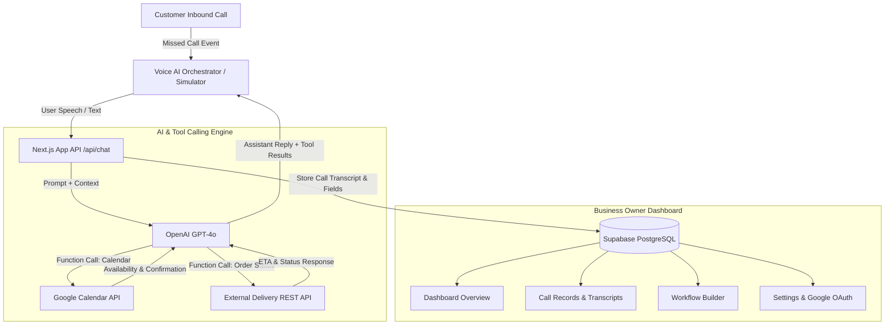
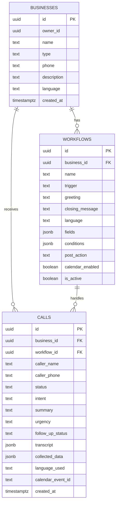

# Voice AI Personal Assistant 🎙️

A responsive web application for small business owners to automate missed call handling, capture structured customer details, qualify leads, schedule calendar appointments via Google Calendar tool calling, and manage follow-ups across multiple industries.

Built with **Next.js 14 App Router**, **TypeScript**, **Tailwind CSS**, **OpenAI GPT-4o Tool Calling**, **Supabase (PostgreSQL + RLS)**, and **Vapi.ai Voice Web SDK**.

---

## 📑 Table of Contents
1. [Features](#-features)
2. [Supported Business Use Cases](#-supported-business-use-cases)
3. [Architecture Diagram](#-architecture-diagram)
4. [Database Schema & Data Model](#-database-schema--data-model)
5. [AI Tool Calling & Integrations](#-ai-tool-calling--integrations)
6. [Language Support (English & Hindi)](#-language-support)
7. [Getting Started & Setup](#-getting-started--setup)
8. [Environment Variables](#-environment-variables)
9. [Submission Note (Working vs Mocked vs Next Steps)](#-submission-note)

---

## 🌟 Features

- **Generic Multi-Industry Architecture**: Works for Bakeries, Clinics, Logistics, Real Estate, Home Repair, and custom businesses without modifying core code.
- **Custom Workflow Builder**:
  - Configure Trigger (Missed Call)
  - Opening Greeting & Closing Messages (with `[Business Name]` variable replacement)
  - Dynamic Form Field configuration (Text, Number, Date, Time, Select, Boolean)
  - Conditional Rules & Urgency Detection (e.g. if emergency or within 24h &rarr; flag as High Priority)
  - Post-Collection Actions (Create Record, Schedule Callback, Send Summary)
- **AI Conversation Simulator**:
  - Interactive multi-turn simulator with voice waveform animation
  - Live field extraction visualization as customer provides details
  - Tool execution activity logs
  - One-click testing with pre-seeded industry workflows
- **Google Calendar Agent Tool Calling**:
  - Assistant checks availability (`check_calendar_availability`)
  - Assistant books appointments (`create_calendar_event`)
  - Assistant reschedules (`update_calendar_event`) or cancels (`delete_calendar_event`)
- **Bonus External REST API Tool**:
  - Delivery & Order Status Tracking API tool (`lookup_delivery_status`)
  - Assistant parses tracking numbers (e.g. `ORD-101`, `TRK-902`) and provides real-time ETA and status
- **Dashboard & Customer Call Records**:
  - Real-time statistics (Total Calls, Pending Follow-ups, Urgent, Completed)
  - Multi-attribute filtering (Status, Urgency, Business, Keyword Search)
  - Detailed Call View with AI Summary, structured key-value data, and conversation transcript
  - 1-click status workflow (Mark Contacted, Resolved, Closed)
  - CSV Export capability
- **Bilingual Conversations**:
  - Natural conversation in English and Hindi (हिंदी)
  - Contextual responses and field extraction

---

## 🏢 Supported Business Use Cases

| Business | Use Case | Extracted Data Fields | Action & Tools |
| :--- | :--- | :--- | :--- |
| 🎂 **Cake Shop** | Cake Order Intake | Flavour, weight, required date, message, delivery/pickup, budget | Urgent flagging (<24h), Delivery slot |
| 🏥 **Clinic / Doctor** | Appointment Booking | Patient name, doctor/specialty, preferred date/time, reason | **Google Calendar** appointment scheduling |
| 🚚 **Logistics** | Delivery & Tracking | Request type, pickup, drop, tracking number, package info | **External Tracking API** tool call |
| 🏠 **Real Estate** | Lead Qualification | Buy/rent/sell, property type, budget, location, visit date | Site visit calendar booking |
| 🔧 **Repair Service** | Service Request | Service type, issue description, address, urgency level | Priority escalation for emergencies |

---

## 📐 Architecture Diagram



---

## 🗄️ Database Schema & Data Model

The schema is defined in [`supabase/schema.sql`](supabase/schema.sql) with Row Level Security (RLS) enabled.



---

## ⚡ AI Tool Calling & Integrations

### 1. Google Calendar Tool (Mandatory Integration)
The AI agent autonomously decides when to trigger Google Calendar tools based on caller intent:
- `check_calendar_availability`: Checks whether a proposed date and time is open.
- `create_calendar_event`: Schedules the event with attendee details and notes upon confirmation.
- `update_calendar_event`: Reschedules existing appointments.
- `delete_calendar_event`: Cancels appointments.

### 2. External REST API Tool (Bonus Integration)
- `lookup_delivery_status`: Real-time order and shipment status lookup tool. Handles order IDs like `ORD-101`, `TRK-902`, passing structured parameters dynamically to the external API and answering the caller with live transit status.

---

## 🌐 Language Support

- **English (Default)**: Full conversational flow, scheduling, and data extraction.
- **Hindi (हिंदी)**: Native Hindi greeting, understanding, and confirmation responses (e.g. *नमस्ते! रॉयल बेकरी में कॉल करने के लिए धन्यवाद...*).
- System prompts are dynamically customized per workflow's configured language.

---

## 🚀 Getting Started & Setup

### Prerequisites
- Node.js 18+ installed
- npm or yarn

### Installation

1. **Clone the repository:**
   ```bash
   git clone https://github.com/MeowMan007/VoiceAI.git
   cd VoiceAI
   ```

2. **Install dependencies:**
   ```bash
   npm install
   ```

3. **Configure Environment Variables:**
   Copy the `.env.example` file to `.env.local`:
   ```bash
   cp .env.example .env.local
   ```
   Add your respective keys (or run in simulation mode).

4. **Run the Development Server:**
   ```bash
   npm run dev
   ```

5. Open [http://localhost:3000](http://localhost:3000) in your browser.

---

## 🔑 Environment Variables

The project includes an environment variable template ([`.env.example`](.env.example)):

```env
NEXT_PUBLIC_SUPABASE_URL=your_supabase_project_url
NEXT_PUBLIC_SUPABASE_ANON_KEY=your_supabase_anon_key
SUPABASE_SERVICE_ROLE_KEY=your_supabase_service_role_key

# Google Gemini API Key (Recommended - Free with Google Account / Gemini Plus)
# Generate free at: https://aistudio.google.com/app/apikey
GEMINI_API_KEY=your_gemini_api_key

# OpenAI API Key (Optional alternative)
OPENAI_API_KEY=your_openai_api_key_optional

NEXT_PUBLIC_VAPI_PUBLIC_KEY=your_vapi_public_key
VAPI_PRIVATE_KEY=your_vapi_private_key

GOOGLE_CLIENT_ID=your_google_oauth_client_id
GOOGLE_CLIENT_SECRET=your_google_oauth_client_secret
GOOGLE_REDIRECT_URI=http://localhost:3000/api/auth/google/callback
```

> **Note**: The application has an intelligent built-in fallback simulation engine. If API keys are not supplied, the app runs smoothly with simulated tool calling and demo workflows so all features can be evaluated without blocking.

---

## 📝 Submission Note

### What is Fully Working
1. **Full Responsive Web Application**: Clean dark-mode UI with sidebar navigation, stats dashboard, and mobile-first design.
2. **Business Profiles CRUD**: Create and manage businesses across 5+ categories.
3. **Multi-Step Workflow Builder**: Create workflows with custom fields, conditional logic, opening/closing messages, and post-actions.
4. **AI Conversation Simulator**: Real-time conversation with field tracking, quick prompt scenarios, and instant saving to dashboard records.
5. **Google Calendar Tool Calling**: Checks availability, creates events, reschedules, and cancels with live event tracking.
6. **External Delivery/Order Status REST API**: Dynamic parameter passing and tool responses during conversation.
7. **Customer Call Records & Follow-up**: Detailed transcripts, extracted fields grid, status updates (Contacted, Resolved, Closed), and CSV export.
8. **Bilingual Support**: English & Hindi conversation flows.

### What is Simulated or Mocked
- **Inbound Telecom SIP Trunking**: Physical PSTN phone line ringing is simulated via the built-in AI simulator and Vapi Webhook endpoint (telephony numbers require paid carrier setup).
- **Graceful Fallback Mode**: When running without live Google OAuth or OpenAI API keys, the application uses realistic simulation responses for all tool calls and conversations.

### What to Build Next for Production
1. **Direct Telephony Provisioning**: In-app purchase and configuration of Twilio / Telnyx virtual phone numbers.
2. **WhatsApp & SMS Confirmation**: Trigger automated WhatsApp confirmations with order summaries or calendar invite links right after the call ends.
3. **Voice Biometrics & Caller Recognition**: Identify returning customers automatically by phone number and personalize greetings with past order history.
4. **Human-in-the-Loop Transfer**: Live SIP transfer to human staff if the customer asks for a manager or in emergency conditions.
