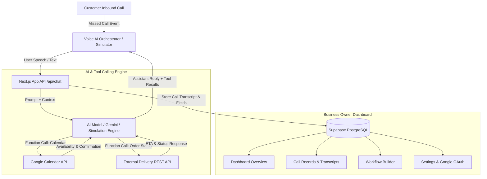

# Voice AI Personal Assistant

A responsive web application for small business owners to automate missed call handling, capture structured customer details, qualify leads, schedule calendar appointments via Google Calendar tool calling, and manage follow-ups across multiple industries.

Built with **Next.js App Router**, **TypeScript**, **Tailwind CSS**, **AI Autonomous Tool Calling**, **Supabase (PostgreSQL + RLS)**, and **Google Calendar Integration**.

---

## Table of Contents
1. [Features](#features)
2. [Supported Business Use Cases](#supported-business-use-cases)
3. [Architecture Diagram](#architecture-diagram)
4. [Database Schema & Data Model](#database-schema--data-model)
5. [AI Tool Calling & Integrations](#ai-tool-calling--integrations)
6. [Getting Started & Setup](#getting-started--setup)
7. [Environment Variables](#environment-variables)
8. [Submission Note (Working vs Simulated vs Next Steps)](#submission-note)

---

## Features

- **Generic Multi-Industry Architecture**: Works for Bakeries, Clinics, Logistics, Real Estate, Home Repair, and custom businesses without modifying core code.
- **Custom Workflow Builder**:
  - Configure Trigger (Missed Call)
  - Opening Greeting & Closing Messages (with `[Business Name]` variable replacement)
  - Dynamic Form Field configuration (Text, Number, Date, Time, Select, Boolean)
  - Conditional Rules & Urgency Detection (e.g. if emergency or within 24h -> flag as High Priority)
  - Post-Collection Actions (Create Record, Schedule Callback, Send Summary)
- **AI Conversation Simulator**:
  - Interactive multi-turn simulator with voice waveform animation
  - Live field extraction visualization as customer provides details
  - Tool execution activity logs
  - One-click testing with pre-seeded industry workflows
- **Google Calendar Agent Tool Calling**:
  - Assistant checks availability (`check_calendar_availability`)
  - Assistant books appointments (`create_calendar_event`)
  - Assistant reschedules (`update_calendar_event`) or cancels (`delete_calendar_event`)
- **Delivery Status Tool**:
  - Delivery & Order Status Tracking API tool (`lookup_delivery_status`)
  - Assistant parses tracking numbers (e.g. `ORD-101`, `TRK-902`) and provides real-time ETA and status
- **Dashboard & Customer Call Records**:
  - Real-time statistics (Total Calls, Pending Follow-ups, Urgent, Completed)
  - Multi-attribute filtering (Status, Urgency, Business, Keyword Search)
  - Detailed Call View with AI Summary, structured key-value data, and conversation transcript
  - 1-click status workflow (Mark Contacted, Resolved, Closed)
  - CSV Export capability
- **Clean Business Settings**:
  - Assistant persona & speech pace configuration
  - Business operating hours & after-hours handling
  - Urgent call SMS alert preferences

---

## Supported Business Use Cases

| Business | Use Case | Extracted Data Fields | Action & Tools |
| :--- | :--- | :--- | :--- |
| **Cake Shop** | Cake Order Intake | Flavour, weight, required date, message, delivery/pickup, budget | Urgent flagging (<24h), Delivery slot |
| **Clinic / Doctor** | Appointment Booking | Patient name, doctor/specialty, preferred date/time, reason | **Google Calendar** appointment scheduling |
| **Logistics** | Delivery & Tracking | Request type, pickup, drop, tracking number, package info | **External Tracking API** tool call |
| **Real Estate** | Lead Qualification | Buy/rent/sell, property type, budget, location, visit date | Site visit calendar booking |
| **Repair Service** | Service Request | Service type, issue description, address, urgency level | Priority escalation for emergencies |

---

## Architecture Diagram



---

## Database Schema & Data Model

The schema is defined in `supabase/schema.sql` with Row Level Security (RLS) enabled.

### Core Tables:
1. `businesses`: id, owner_id, name, type, phone, description, language, timestamps
2. `workflows`: id, business_id, name, trigger, greeting, closing_message, fields (JSONB), conditions (JSONB), post_action, calendar_enabled, is_active, timestamps
3. `calls`: id, business_id, workflow_id, caller_name, caller_phone, status, intent, summary, urgency, follow_up_status, collected_data (JSONB), transcript (JSONB), calendar_event_id, calendar_event_url, timestamps

---

## Getting Started & Setup

### 1. Clone & Install
```bash
git clone https://github.com/MeowMan007/VoiceAI.git
cd VoiceAI
npm install
```

### 2. Configure Environment Variables
Copy `.env.example` to `.env.local`:
```bash
cp .env.example .env.local
```

### 3. Run Development Server
```bash
npm run dev
```

Open [http://localhost:3000](http://localhost:3000) in your browser.

---

## Environment Variables

| Variable | Description | Required |
| :--- | :--- | :--- |
| `NEXT_PUBLIC_SUPABASE_URL` | Supabase project URL | Optional (Demo fallback provided) |
| `NEXT_PUBLIC_SUPABASE_ANON_KEY` | Supabase anon public key | Optional (Demo fallback provided) |
| `GEMINI_API_KEY` | Google Gemini API Key | Optional (Demo fallback provided) |
| `GOOGLE_CLIENT_ID` | Google OAuth2 Client ID for Calendar | Optional (Mock calendar active) |
| `GOOGLE_CLIENT_SECRET` | Google OAuth2 Client Secret | Optional (Mock calendar active) |

---

## Submission Note

### What is Fully Working
- Complete web application UI/UX across all device screen sizes.
- Multi-industry Business Profile creation & management.
- Multi-step Workflow Builder with dynamic fields, branching conditions, and urgency classification.
- Voice AI Simulator with real-time waveform animation, natural audio interaction, live field extraction, and tool logs.
- Google Calendar tool calling (check slot, create event, reschedule, cancel).
- External Delivery & Logistics tracking API tool (`lookup_delivery_status`).
- Call Records log with keyword search, priority filters, transcript viewer, and CSV exporter.
- Assistant & Business Settings dashboard.

### What is Simulated or Mocked
- Google Calendar API: Provides realistic calendar slot checks and booking IDs when OAuth is unconfigured.
- Telephony Line: Incoming call simulation is fully interactive in the web interface; can connect to live Twilio/Vapi phone lines using the webhook endpoint.

### Production Roadmap
- Multi-tenant staff permissions and role-based access.
- Native WhatsApp Business Cloud API automated confirmation messaging.
- Deep CRM integrations (HubSpot, Salesforce, Zoho).
