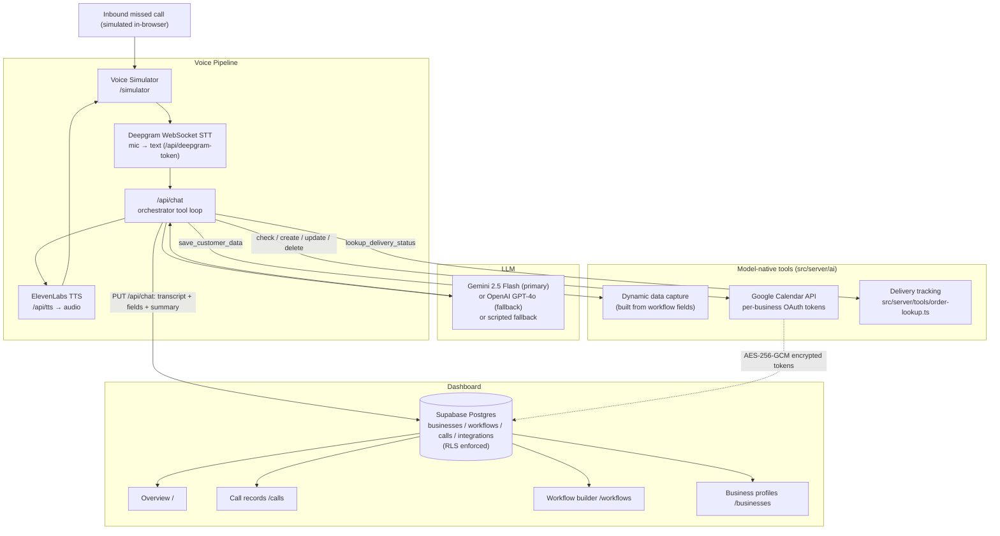

# Voice AI Personal Assistant

A responsive web app for small-business owners to automate missed-call handling: the AI answers as a receptionist, captures structured customer details, qualifies leads, books appointments on Google Calendar via model-native tool calling, and tracks follow-ups — across multiple industries, in English and Hindi.

Built with **Next.js 16 (App Router)**, **TypeScript**, **Supabase (Postgres + Auth + RLS)**, **Google Gemini 2.5 Flash** (primary LLM, OpenAI GPT-4o fallback), **Deepgram** (STT), **ElevenLabs** (TTS), and the **Google Calendar API**.

---

## Table of Contents
1. [State of Play (what is real vs simulated)](#state-of-play)
2. [Features](#features)
3. [Supported Business Use Cases](#supported-business-use-cases)
4. [Architecture](#architecture)
5. [Database & Data Model](#database--data-model)
6. [AI Tool Calling](#ai-tool-calling)
7. [Voice Pipeline](#voice-pipeline)
8. [Getting Started](#getting-started)
9. [Environment Variables](#environment-variables)
10. [Scripts](#scripts)
11. [Security Notes](#security-notes)

---

## State of Play

An honest map of what runs against real services versus what is simulated. "Simulated" always announces itself in the response payload (`simulated: true`) — the app never fabricates a real result.

| Capability | Status | Notes |
|---|---|---|
| Auth (sign up / login / session) | ✅ Real | Supabase Auth; session gated in [`src/proxy.ts`](./src/proxy.ts). **Supabase is required** — the app is not usable without it. |
| Persistence (businesses / workflows / calls / integrations) | ✅ Real | Supabase Postgres with Row Level Security as the authorization boundary. No localStorage/demo database. |
| Conversation + tool calling | ✅ Real | Model-native function calling via Gemini 2.5 Flash (primary) or OpenAI GPT-4o (fallback). Orchestrated tool loop in [`src/server/ai/orchestrator.ts`](./src/server/ai/orchestrator.ts). |
| Scripted fallback (no LLM key) | 🟡 Simulated | If neither `GEMINI_API_KEY` nor `OPENAI_API_KEY` is set, a deterministic scripted responder ([`src/server/ai/fallback.ts`](./src/server/ai/fallback.ts)) keeps the UI demoable. Flagged as `usedFallback: true`. |
| Speech-to-text | ✅ Real | Deepgram nova-2 WebSocket. Requires `DEEPGRAM_API_KEY`. |
| Text-to-speech | ✅ Real | ElevenLabs. Requires `ELEVENLABS_API_KEY`. |
| Voice when a key is missing | 🟡 Degraded, visible | No browser speech APIs are used. If a voice key is absent the simulator shows an explicit error banner and falls back to the live transcript + tap-to-speak phrases — never silent substitution. |
| Google Calendar (connected) | ✅ Real | Per-business OAuth. Real freebusy / insert / update / delete against the primary calendar. |
| Google Calendar (not connected) | 🟡 Simulated | When a business has no calendar integration, calendar tools return `simulated: true` mock results so the flow is demoable. A *connected* calendar that errors surfaces the real failure — it does not fake success. |
| Delivery / order lookup | 🟡 Simulated | [`src/server/tools/order-lookup.ts`](./src/server/tools/order-lookup.ts) returns a fixed demo dataset (`ORD-101`, `ORD-102`, `TRK-902`, + fallback), flagged `simulated: true`. Swap in a real courier API here. |
| Telephony (real inbound PSTN/SIP) | ❌ Not implemented | The "missed call" is simulated in-browser at `/simulator`. There is no phone-network integration; see [What to build next](#what-to-build-next). |

---

## Features

- **Generic multi-industry architecture** — bakeries, clinics, logistics, real estate, home repair, and custom types share one code path.
- **6-step custom workflow builder**:
  - Trigger (missed call)
  - Opening greeting & closing message (with `[Business Name]` substitution)
  - Dynamic data fields (text, number, date, time, select, boolean; required/optional)
  - Conditional rules & urgency detection (5 operators: `equals`, `not_equals`, `contains`, `greater_than`, `less_than`)
  - Post-collection action (create record / schedule callback / send summary)
- **Model-native tool calling** — the LLM decides when to call calendar/delivery/data-capture tools; a bounded loop (max 4 iterations) executes them and feeds results back.
- **Google Calendar agent tools** — `check_calendar_availability`, `create_calendar_event`, `update_calendar_event`, `delete_calendar_event`.
- **Bonus external tool** — `lookup_delivery_status`.
- **Bilingual** — English & Hindi (हिंदी), routed per workflow, with spoken-language auto-detection.
- **Dashboard & call records** — caller, intent, AI summary, urgency, full transcript, structured collected data, follow-up status (Pending → Contacted → Resolved → Closed), 1-click status change, CSV export.

---

## Supported Business Use Cases

| Business | Use Case | Extracted Data | Tools |
| :--- | :--- | :--- | :--- |
| **Cake Shop (EN & HI)** | Cake order intake | Order type, flavour, weight, required date, delivery/pickup | Urgency flag when required date is `< 24h` away |
| **Clinic / Doctor (EN & HI)** | Appointment booking | Patient name, preferred date/time, contact number | **Google Calendar** scheduling |
| **Logistics & Delivery** | Courier tracking | Tracking number, locations, package type | **Delivery lookup** tool |
| **Real Estate** | Viewing & lead capture | Budget, property type, location, visit slot | **Google Calendar** site visit |
| **Home Repair & Service** | Emergency dispatch | Service type, issue, urgency, address | Priority escalation |

---

## Architecture



**Request lifecycle for one turn:** the simulator POSTs the running message list to `/api/chat`. `runConversationTurn` builds the system prompt + tool schemas, calls the LLM with `tool_choice: 'auto'`, executes any tool calls (calendar / delivery / data capture), and loops (≤4) until the model returns a plain reply. When the call ends, the client `PUT`s the transcript to `/api/chat`, which generates a summary, computes urgency from the workflow conditions, and inserts a `calls` row.

---

## Database & Data Model

Schema: [`supabase/schema.sql`](./supabase/schema.sql). Full column/RLS reference: [`docs/DATABASE.md`](./docs/DATABASE.md).

| Table | Purpose |
|---|---|
| `businesses` | One row per business, owned by an `auth.users` id. |
| `workflows` | The 6-step builder output: greeting/closing, `fields` (JSONB), `conditions` (JSONB), `calendar_enabled`. |
| `calls` | Captured call: caller, intent, summary, urgency, `transcript` (JSONB), `collected_data` (JSONB), calendar event id/url, follow-up status. |
| `integrations` | Per-business third-party credentials. Google Calendar access/refresh tokens stored **AES-256-GCM encrypted**. |

Every table has RLS enabled. Owners reach their own rows through `auth.uid()`-scoped policies; server code that must bypass RLS uses a `FOR ALL TO service_role` policy with the service-role key. Run `npm run check-rls` to lint these invariants.

---

## AI Tool Calling

Tool schemas are declared once in OpenAI function format in [`src/server/ai/tools.ts`](./src/server/ai/tools.ts) and translated to Gemini `functionDeclarations` in [`src/server/ai/llm.ts`](./src/server/ai/llm.ts), so the same definitions drive either provider.

| Tool | When offered | Parameters | Effect |
|---|---|---|---|
| `save_customer_data` | Always (shape built from the workflow's fields) | one property per workflow field | Merges captured values into `collected_data` |
| `check_calendar_availability` | When `calendar_enabled` | date, time, duration_minutes | Freebusy check (real or simulated) |
| `create_calendar_event` | When `calendar_enabled` | title, date, time, duration_minutes, description, attendee_name | Books the appointment |
| `update_calendar_event` | When `calendar_enabled` | event_id, new_date, new_time, new_title | Reschedules |
| `delete_calendar_event` | When `calendar_enabled` | event_id, reason | Cancels |
| `lookup_delivery_status` | Always | order_id | Order/courier status (simulated dataset) |

The loop lives in [`src/server/ai/orchestrator.ts`](./src/server/ai/orchestrator.ts) (`MAX_TOOL_ITERATIONS = 4`). Condition/urgency logic and its unit tests are in [`src/server/ai/conditions.ts`](./src/server/ai/conditions.ts) / [`conditions.test.ts`](./src/server/ai/conditions.test.ts).

---

## Voice Pipeline

- **STT** — Deepgram nova-2 over WebSocket. The browser fetches a short-lived token from `/api/deepgram-token` (the key never reaches the client) and streams mic audio.
- **TTS** — ElevenLabs via `/api/tts` (multilingual v2 for Hindi, Turbo v2.5 for English).
- **No browser speech APIs.** `window.speechSynthesis` / `SpeechRecognition` are intentionally not used. If `DEEPGRAM_API_KEY` or `ELEVENLABS_API_KEY` is missing, the simulator renders a visible error banner explaining what to set, keeps the live transcript working, and offers tap-to-speak quick phrases — it never silently swaps in the browser engines.

---

## Getting Started

### 1. Install
```bash
git clone https://github.com/MeowMan007/VoiceAI.git
cd VoiceAI
npm install
```

### 2. Configure environment
```bash
cp .env.example .env.local
```
Fill in the values (see [Environment Variables](#environment-variables)). At minimum you need the three Supabase variables and one LLM key.

### 3. Create the database
In the Supabase SQL editor, run [`supabase/schema.sql`](./supabase/schema.sql). Then sign up in the app, and optionally seed demo data:
```bash
SEED_USER_ID=<your-auth-user-uuid> npm run seed
```

### 4. Run
```bash
npm run dev
```
Open [http://localhost:3000](http://localhost:3000), create a business + workflow (or seed them), then open **/simulator** to run a voice call.

### Google Calendar (optional, per business)
1. Create OAuth 2.0 credentials in the [Google Cloud Console](https://console.cloud.google.com) with redirect `http://localhost:3000/api/auth/google/callback`.
2. Set `GOOGLE_CLIENT_ID`, `GOOGLE_CLIENT_SECRET`, `GOOGLE_REDIRECT_URI`, and `INTEGRATION_CREDENTIALS_ENCRYPTION_KEY`.
3. In the app, open a **business profile** (`/businesses/<id>`) → **Connect Calendar**. Calendar is connected per business, not globally.

---

## Environment Variables

| Variable | Required | Description |
| :--- | :--- | :--- |
| `NEXT_PUBLIC_SUPABASE_URL` | **Yes** | Supabase project URL. The app requires Supabase. |
| `NEXT_PUBLIC_SUPABASE_ANON_KEY` | **Yes** | Supabase anon key (client + session). |
| `SUPABASE_SERVICE_ROLE_KEY` | **Yes** | Service-role key for server-side admin access (calendar token store, seeding). Server-only. |
| `GEMINI_API_KEY` | **Yes¹** | Google Gemini 2.5 Flash — primary LLM. Free key from Google AI Studio. |
| `OPENAI_API_KEY` | Optional | OpenAI GPT-4o — used as fallback and for summaries. |
| `ELEVENLABS_API_KEY` | For voice | ElevenLabs TTS. |
| `ELEVENLABS_VOICE_ID` | Optional | English voice id. |
| `ELEVENLABS_HINDI_VOICE_ID` | Optional | Hindi voice id. |
| `DEEPGRAM_API_KEY` | For voice | Deepgram STT. |
| `GOOGLE_CLIENT_ID` | For Calendar | Google OAuth2 client id. |
| `GOOGLE_CLIENT_SECRET` | For Calendar | Google OAuth2 client secret. |
| `GOOGLE_REDIRECT_URI` | For Calendar | `http://localhost:3000/api/auth/google/callback`. |
| `INTEGRATION_CREDENTIALS_ENCRYPTION_KEY` | For Calendar | 32 bytes as **64 hex chars**. Encrypts calendar tokens at rest (AES-256-GCM). Generate: `openssl rand -hex 32`. |
| `GOOGLE_OAUTH_STATE_SECRET` | Recommended | HMAC secret for signing the OAuth `state`. Falls back to `INTEGRATION_CREDENTIALS_ENCRYPTION_KEY`, then `NEXTAUTH_SECRET`. **Required in production.** |
| `SEED_USER_ID` | For seeding | Auth user UUID that `npm run seed` assigns demo businesses to. |
| `NEXTAUTH_SECRET` | Optional | Generic app secret; also a last-resort OAuth-state signing key. |

¹ At least one LLM key (`GEMINI_API_KEY` or `OPENAI_API_KEY`) is needed for real conversation; without either, the app runs the scripted fallback.

---

## Scripts

```bash
npm run dev         # start Next.js dev server
npm run build       # production build
npm run typecheck   # tsc --noEmit
npm test            # node --test (condition/urgency unit tests)
npm run seed        # insert demo businesses + workflows (needs SEED_USER_ID)
npm run check-rls   # lint supabase/schema.sql RLS invariants
```

---

## Security Notes

- **RLS is the authorization boundary.** API routes additionally re-check ownership (`assertOwnsBusiness`) before acting on a business, workflow, or call.
- **OAuth tokens never appear in a URL.** The callback exchanges the code server-side, encrypts the tokens, and stores them in `integrations`; the browser is redirected back with only a `google_connected` / `error` flag.
- **Calendar tokens are encrypted at rest** with AES-256-GCM (`INTEGRATION_CREDENTIALS_ENCRYPTION_KEY`).
- **OAuth `state` is HMAC-signed** and time-limited to bind the callback to the initiating user + business; signing refuses to fall back to a dev secret in production.

## What to Build Next
1. **Real telephony** — bridge inbound PSTN/SIP (e.g. Twilio Programmable Voice) into the existing `/api/chat` turn loop.
2. **Real courier API** — replace the simulated dataset in `src/server/tools/order-lookup.ts`.
3. **WhatsApp summary** — push the collected-info summary to the owner via WhatsApp Business API.
4. **Analytics** — call-volume trends, conversion, peak-hour heatmaps.
