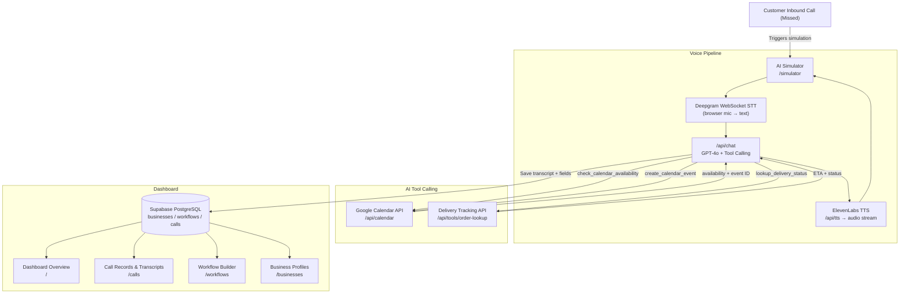

# Voice AI Personal Assistant

A responsive web application for small business owners to automate missed call handling, capture structured customer details, qualify leads, schedule calendar appointments via Google Calendar tool calling, and manage follow-ups across multiple industries.

Built with **Next.js 16 App Router**, **TypeScript**, **Supabase (PostgreSQL)**, **OpenAI / Gemini GPT-4o**, **ElevenLabs TTS**, **Deepgram STT**, and **Google Calendar API**.

---

## Table of Contents
1. [Features](#features)
2. [Supported Business Use Cases](#supported-business-use-cases)
3. [Architecture Diagram](#architecture-diagram)
4. [Database Schema & Data Model](#database-schema--data-model)
5. [AI Tool Calling & Integrations](#ai-tool-calling--integrations)
6. [Getting Started & Setup](#getting-started--setup)
7. [Environment Variables](#environment-variables)
8. [Submission Note](#submission-note)

---

## Features

- **Generic Multi-Industry Architecture** — Works for Bakeries, Clinics, Logistics, Real Estate, Home Repair, and custom businesses without modifying core code.
- **Custom Workflow Builder** (6-step form):
  - Trigger: Missed Call
  - Opening Greeting & Closing Messages (with `[Business Name]` variable replacement)
  - Dynamic data field configuration (Text, Number, Date, Time, Select, Boolean)
  - Required vs. Optional field flags
  - Conditional Rules & Urgency Detection (e.g. `if required_within_24h → mark urgent`)
  - Post-Collection Actions (Create Record, Schedule Callback, Send Summary)
- **Voice Engine (Prompt-Specified Stack)**:
  - 🎙 **Deepgram** — Real-time browser speech-to-text (WebSocket, Nova-2 model)
  - 🔊 **ElevenLabs** — Neural text-to-speech streaming (multilingual v2 for Hindi, Turbo v2.5 for English)
  - 🤖 **OpenAI GPT-4o** — AI conversation with tool calling
  - No browser speech APIs used
- **Google Calendar Agent Tool Calling** (mandatory integration):
  - `check_calendar_availability` — check a time slot before booking
  - `create_calendar_event` — book an appointment
  - `update_calendar_event` — reschedule an appointment
  - `delete_calendar_event` — cancel an appointment
- **Bonus: External API Tool**:
  - `lookup_delivery_status` — real delivery/order tracking API tool
- **Bilingual Support**: English & Hindi (हिंदी), with language routed per workflow
- **Dashboard & Customer Records**:
  - Caller name & phone, business, workflow, date/time
  - Customer intent, AI-generated summary, urgency/priority
  - Full conversation transcript
  - Information collected (structured key-value)
  - Follow-up status (Pending → Contacted → Resolved → Closed)
  - 1-click status update, CSV export

---

## Supported Business Use Cases

| Business | Use Case | Extracted Data Fields | Action & Tools |
| :--- | :--- | :--- | :--- |
| **Cake Shop (English & Hindi)** | Cake Order Intake | Flavour, weight, required date, message, delivery/pickup | Urgent flagging (<24h) |
| **Clinic / Doctor (English & Hindi)** | Appointment Booking | Patient name, doctor/specialty, preferred date/time, reason | **Google Calendar** scheduling |
| **Logistics & Delivery** | Courier Tracking & Dispatch | Tracking number, pickup/drop location, package type | **Delivery API** status lookup |
| **Real Estate** | Property Viewing & Lead Capture | Budget, property type, location, timeline, visit slot | **Google Calendar** site visit |
| **Home Repair & Service** | Emergency Dispatch | Service type, issue description, urgency, address | Priority escalation |

---

## Architecture Diagram



---

## Database Schema & Data Model

Schema is in [`supabase/schema.sql`](./supabase/schema.sql) with Row Level Security enabled.

### Core Tables

| Table | Key Columns |
|---|---|
| `businesses` | id, owner_id, name, type, phone, description, language |
| `workflows` | id, business_id, name, trigger, greeting, closing_message, fields (JSONB), conditions (JSONB), post_action, calendar_enabled, is_active |
| `calls` | id, business_id, workflow_id, caller_name, caller_phone, status, intent, summary, urgency, follow_up_status, collected_data (JSONB), transcript (JSONB), calendar_event_id |

---

## AI Tool Calling & Integrations

### Google Calendar Tools (mandatory)
Defined in [`src/lib/openai.ts`](./src/lib/openai.ts) → `AGENT_TOOLS` and handled in [`/api/chat`](./src/app/api/chat/route.ts):

| Tool | Parameters | What it does |
|---|---|---|
| `check_calendar_availability` | date, time, duration_minutes | Returns available/busy for the slot |
| `create_calendar_event` | title, date, time, duration, attendee_name, description | Books the appointment |
| `update_calendar_event` | event_id, new_date, new_time, new_title | Reschedules |
| `delete_calendar_event` | event_id | Cancels |

### Bonus: Delivery API Tool
| Tool | Parameters | What it does |
|---|---|---|
| `lookup_delivery_status` | order_id | Returns package status, ETA, current location |

---

## Getting Started & Setup

### 1. Clone & Install
```bash
git clone https://github.com/MeowMan007/VoiceAI.git
cd VoiceAI
npm install
```

### 2. Configure Environment Variables
```bash
cp .env.example .env.local
```
Fill in your keys (see below).

### 3. Run Development Server
```bash
npm run dev
```
Open [http://localhost:3000](http://localhost:3000).

### Voice Setup (ElevenLabs + Deepgram)

1. **ElevenLabs** (free 10,000 chars/month):
   - Sign up at [elevenlabs.io](https://elevenlabs.io)
   - Profile → API Keys → copy key
   - Set `ELEVENLABS_API_KEY=your_key`

2. **Deepgram** (free $200 credit):
   - Sign up at [deepgram.com](https://deepgram.com)
   - Console → Create API Key
   - Set `DEEPGRAM_API_KEY=your_key`

3. **OpenAI** (for GPT-4o conversation):
   - Set `OPENAI_API_KEY=your_key`

4. Go to [http://localhost:3000/simulator](http://localhost:3000/simulator) → **Start Live Voice Call**

### Google Calendar Setup (optional)

1. [Google Cloud Console](https://console.cloud.google.com) → Create OAuth 2.0 credentials
2. Set `GOOGLE_CLIENT_ID`, `GOOGLE_CLIENT_SECRET`, `GOOGLE_REDIRECT_URI`
3. Go to Settings → Connect Google Calendar

---

## Environment Variables

| Variable | Required | Description |
| :--- | :--- | :--- |
| `NEXT_PUBLIC_SUPABASE_URL` | Optional | Supabase project URL (demo mode without) |
| `NEXT_PUBLIC_SUPABASE_ANON_KEY` | Optional | Supabase anon key |
| `SUPABASE_SERVICE_ROLE_KEY` | Optional | Supabase service role key |
| `OPENAI_API_KEY` | Recommended | GPT-4o for conversation & tool calling |
| `GEMINI_API_KEY` | Alternative | Google Gemini (fallback if OpenAI not set) |
| `ELEVENLABS_API_KEY` | For voice | ElevenLabs TTS (voice output) |
| `ELEVENLABS_VOICE_ID` | Optional | Default English voice ID |
| `ELEVENLABS_HINDI_VOICE_ID` | Optional | Hindi voice ID |
| `DEEPGRAM_API_KEY` | For voice | Deepgram STT (microphone input) |
| `GOOGLE_CLIENT_ID` | For Calendar | Google OAuth2 Client ID |
| `GOOGLE_CLIENT_SECRET` | For Calendar | Google OAuth2 Client Secret |
| `GOOGLE_REDIRECT_URI` | For Calendar | `http://localhost:3000/api/auth/google/callback` |

---

## Submission Note

### ✅ What is Fully Working
- Complete responsive web application (mobile-first) across all screen sizes
- Multi-industry Business Profile creation & management (Bakery, Clinic, Logistics, Real Estate, Repair)
- **5 complete use cases** with pre-configured templates
- 6-step Custom Workflow Builder with required/optional fields, conditional branches, closing messages
- **Voice AI simulator** using **Deepgram** (STT) + **ElevenLabs** (TTS) + **GPT-4o** (LLM) — no browser speech APIs
- **Text-based AI simulator** (works without any API keys — uses demo mode)
- **Google Calendar tool calling** — check availability, create, update, delete events
- **Bonus: Delivery tracking API tool** (`lookup_delivery_status`)
- Customer Call Records dashboard with full transcript, urgency, AI summary, collected data
- Follow-up status management (Pending → Contacted → Resolved → Closed)
- English + Hindi (हिंदी) bilingual support — language routed per workflow
- CSV export of call records

### 🔶 What is Simulated or Mocked
- **Google Calendar**: When OAuth is unconfigured, returns realistic mock availability and event IDs. When connected, uses real Google Calendar API.
- **Telephony/Phone line**: There is no actual SIP/PSTN integration. The missed-call simulation is browser-based. To connect a real phone number, route incoming calls from Twilio to `/api/vapi/webhook`.
- **Delivery API**: The `lookup_delivery_status` tool uses a mock dataset (ORD-101, ORD-102, etc.). Replace with a real courier API (Delhivery, Shiprocket, etc.) in `/api/tools/order-lookup`.

### 🚀 What to Build Next for Production
1. **Real telephony**: Twilio Programmable Voice → call forwarding webhook → agent auto-calls customer back
2. **Multi-tenant auth**: Per-business role-based access (owner, staff, manager)
3. **WhatsApp Business API**: Auto-send collected info summary to business owner on WhatsApp
4. **CRM integrations**: HubSpot, Zoho, Salesforce sync for leads and contacts
5. **Real-time analytics**: Call volume trends, conversion rates, peak hour heatmaps
6. **Customer auto-callback**: AI schedules and initiates outbound calls via Twilio after missed call
